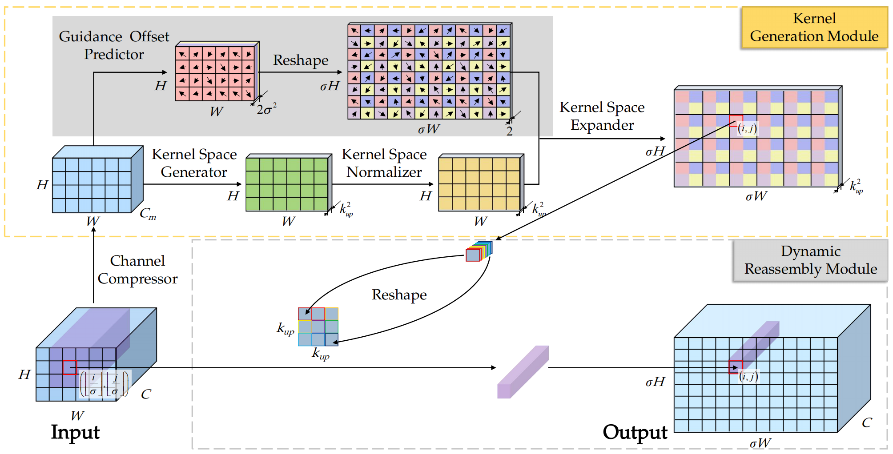

# DLU implementation in Pytorch 

Code for the paper:
### [Lighten CARAFE: Dynamic Lightweight Upsampling with Guided Reassemble Kernels]

to be presented at **ICPR 2024**,
<br>
Authors:
<br>
Ruigang Fu,
Qingyong Hu,
Xiaohu Dong,
Yinghui Gao,
Biao Li and
Ping Zhong
<br>

----------



## Requirements
### 1. Environment:
The requirements are exactly the same as mmdetection(https://github.com/open-mmlab/mmdetection). We tested on the following settings:

- python 3.8
- cuda 10.1
- pytorch 1.8.1+cu101
- torchvision 0.9.1+cu101
- mmcv 2.1.0


```setup
conda create -n dlu python=3.8 -y
source activate dlu
conda activate dlu
pip install torch==1.8.1+cu101 torchvision==0.9.1+cu101 torchaudio==0.8.1 -f https://download.pytorch.org/whl/torch_stable.html
pip install -U openmim
mim install mmengine
mim install "mmcv>=2.0.0"
git clone https://github.com/Fu0511/Dynamic-Lightweight-Upsampling.git
cd mmdetection
pip install -v -e .
```

### 2. Data:

The folder `data` should be like this:
```
    data
    ├── coco
    │   ├── annotations
    │   ├── train2017
    │   ├── val2017
    │   ├── test2017
```

## Training

Use the following commands to train a model.


```train
# Single GPU
python tools/train.py ${CONFIG_FILE}

# Multi GPU distributed training
./tools/dist_train.sh ${CONFIG_FILE} ${GPU_NUM}
```
Config files in our experiments are under `./custom/config/FPN/`.
- `./custom/config/FPN/coco_custom_dlu.py`: FPN model with DLU as its upsampling operation.
- `./custom/config/FPN/coco_custom_carafe`: FPN model with carafe as its upsampling operation.
- `./custom/config/FPN/coco_baseline_bilinear`: FPN model with bilinear as its upsampling operation.


## Results
#### The main results on coco val set:
| Method   |   AP  | Additional Model Size|
| -------- | ----- | -------------------- | 
| Bilinear | 37.5  |          --          |
| CARAFE   | 38.6  |       +1.2MB         |
| DLU      | 38.6  |       +0.6MB         |


----------
If these codes are useful to you, please cite our work:
```
@misc{fu2024Lighten,
    title={Lighten CARAFE: Dynamic Lightweight Upsampling with Guided Reassemble Kernels},
    author={Ruigang Fu and Qingyong Hu and Xiaohu Dong and Yinghui Gao and Biao Li and Ping Zhong},
    year={2024},
    eprint={2410.22139},
    archivePrefix={arXiv},
    primaryClass={cs.CV}
}
```
